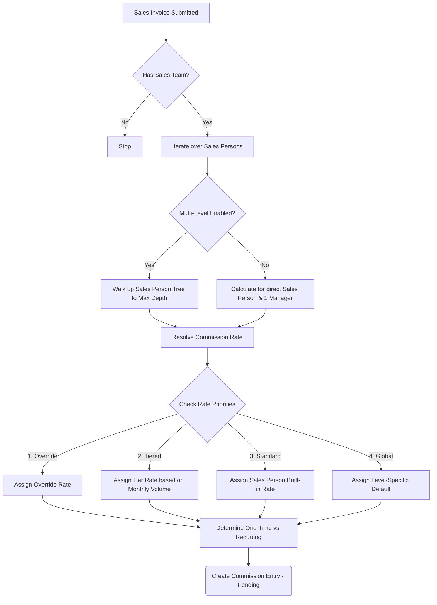
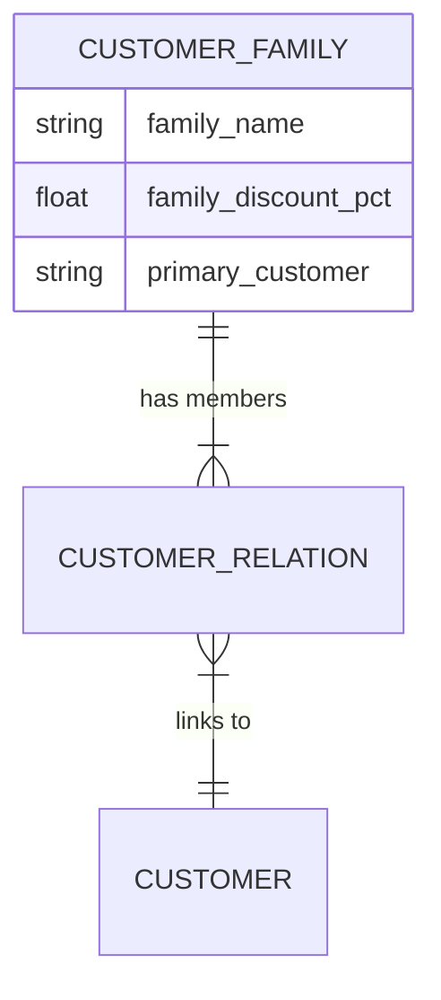

# 🚀 Commission Engine for ERPNext

An enterprise-grade, highly configurable Commission Management application for ERPNext. Designed for teams with complex sales structures, multi-level hierarchies, tiered goals, and strict financial controls.

---

## ✨ Key Features

1. **Dynamic Multi-Level Commission Hierarchy**
   - Supports unlimited depths of management (Sales Manager, Regional Manager, VP, etc.) using ERPNext's native Sales Person tree.
   - Global default rates per hierarchy level.
2. **Four-Level Rate Resolution Priority**
   - **Priority 1:** Specific Person Override (e.g., John gets 15%, regardless of his level).
   - **Priority 2:** Volume-Based Tiers (e.g., 5% up to $10k, 10% for $10k+).
   - **Priority 3:** Standard Sales Person Rate (ERPNext built-in setting).
   - **Priority 4:** Global Level Default (e.g., All Level 2 Managers get 3%).
3. **One-Time vs. Recurring Differentiators**
   - Reward hunters vs. farmers by offering different rates for a customer's First Invoice vs. Subsequent Invoices.
4. **Smart Clawbacks (Return/Credit Note Support)**
   - Fully automated financial integrity: When an invoice is returned, the system automatically creates negative Commission Entries to claw back the exact amount paid.
5. **Approval Workflow & Accounting Integration**
   - Multi-stage approval (Pending -> Approved -> Paid).
   - Auto-generates Journal Entries for Commission Expense vs. Payable upon approval.
6. **Customer Family & Protection System**
   - Group related customers (Parent, Subsidiary, Spouse).
   - **Sales Protection:** Only a manager in the salesperson's direct upline can re-assign a customer's sales team.
   - **Family Discounts:** Auto-magically applies a master Family Discount % to any sales invoice generated for a family member.

---

## 🏗️ Architecture & Data Flow

When a **Sales Invoice** is Submitted, the engine springs into action. Here is the visual workflow:

---

## 🔄 The Lifecycle of a Commission

### 1. Generation
* The engine triggers on `Sales Invoice (on_submit)`.
* It calculates the Allocated Amount for each salesperson.
* It traces up the management tree and creates a `Commission Entry` child for everyone in the upline entitled to a percentage.

### 2. Approval
* Finance/Sales Admins review the generated `Commission Entry` docs.
* Using the **Commission Summary Report**, managers can instantly see total liabilities.
* The entry is transitioned from `Pending` -> `Approved`.

### 3. Accounting & Payment (Optional)
* If `Auto-Create Journal Entry` is enabled in settings, approving an entry will automatically post a Journal Entry debiting your `Commission Expense Account` and crediting the `Commission Payable Account`.
* Once actually paid out via Payroll or standard Payment Entry, the status is moved to `Paid`.

---

## 👨‍👩‍👧‍👦 Customer Family & Protection

The Customer Family system adds crucial CRM capabilities for B2B and nested B2C sales.

* **Protection:** To prevent salespeople from stealing accounts, the system enforces strict hierarchy rules. If Sales Person A is assigned to a Customer, Sales Person B *cannot* change it. Only Sales Person A's direct Manager (or System Admin) can re-assign the account.
* **Auto-Discount:** Creating an invoice for any `Customer` will dynamically check their `Customer Family`. If the family has a `family_discount_pct` of 10%, a 10% Additional Discount is immediately injected into the invoice.

---

## ⚙️ Configuration Setup

1. Search for **Commission Settings** in the awesomebar.
2. Select your default Expense and Payable tracking accounts.
3. Define your **Commission Level Defaults** for different tiers of management.
4. Set optional **Minimum Invoice Thresholds** (invoices below this skip commission) and **Maximum Caps** (limits max payout on whale deals).
5. Toggle **Enable Approval Workflow** to lock entries from being manipulated by non-admins.
