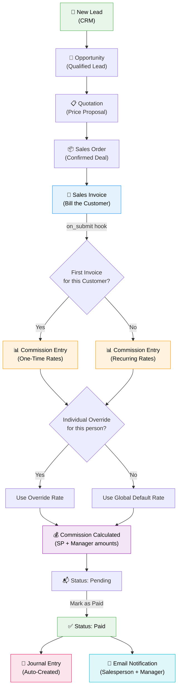

# Commission Engine for ERPNext

**Automated multi-level sales commission calculation for ERPNext v16**

Commission Engine automatically calculates salesperson and manager commissions when Sales Invoices are submitted. It supports first-invoice (one-time) and recurring commission rates, individual rate overrides, automated journal entries, and email notifications.

---

## How It Works



### Commission Flow Summary

| Stage | What Happens |
|-------|-------------|
| **Lead → Customer** | Sales Person is assigned during the CRM process |
| **Sales Invoice Submitted** | Commission Entry auto-created via `on_submit` hook |
| **First Invoice?** | System checks if this customer had prior invoices |
| **Rate Selection** | Individual override → or → Global default rate |
| **Commission Calculated** | Salesperson % + Manager % applied to invoice amount |
| **Mark as Paid** | Journal Entry auto-created + Email notification sent |

---

## Installation

```bash
# Get the app
bench get-app https://github.com/codepromaxtech/erpnext_crm_commission_engine.git

# Install on your site
bench --site your-site.com install-app commission_engine

# Build and restart
bench build --app commission_engine
sudo supervisorctl restart all
```

On install, the app automatically:
- Creates **Commission Expense** and **Commission Payable** accounts
- Enables **Auto-Create Journal Entry on Payment**
- Sets default commission rates (10% SP / 2% Manager for first invoice, 5% SP / 1% Manager for recurring)

---

## User Guide

### Step 1: Register a Lead

1. Go to **CRM → Lead → + Add Lead**
2. Fill in the lead's details (name, email, company, etc.)
3. **Assign a Sales Person** — this person will earn commissions later

### Step 2: Convert Lead to Customer

1. Open the Lead → Click **Create → Customer**
2. The Lead converts to a **Customer** with the CRM history preserved
3. The Sales Person from the lead carries forward

> **Tip:** You can also go through the full pipeline:
> Lead → **Opportunity** → **Quotation** → **Sales Order** → **Sales Invoice**
> The Sales Person is carried through each step automatically.

### Step 3: Create a Sales Invoice

1. Go to **Accounting → Sales Invoice → + Add Sales Invoice**
2. Select the **Customer**
3. Add your items
4. **Important:** Check the **Sales Team** section at the bottom — make sure a Sales Person is listed with their contribution %

> ⚠️ If no Sales Person is tagged, a **warning banner** will appear and a confirmation dialog will show when you try to submit.

5. **Submit** the invoice

### Step 4: Commission Entry (Auto-Created)

When you submit the invoice, the system automatically:

1. Detects if this is the **first invoice** for this customer → applies **One-Time rates**
2. Or if it's a **subsequent invoice** → applies **Recurring rates**
3. Looks up the salesperson's **manager** via the Sales Person tree hierarchy
4. Checks for **individual rate overrides** in Commission Settings
5. Creates a **Commission Entry** with calculated amounts

You can view the commission entry:
- From the Sales Invoice → **Connections sidebar** → Commission section
- Or go to **Commission Engine → Commission Entry** list

### Step 5: Pay the Commission

1. Open the **Commission Entry**
2. Click **Actions → Mark as Paid**
3. The system will:
   - Auto-create a **Journal Entry** (debit Commission Expense, credit Commission Payable)
   - Send an **email notification** to the salesperson and their manager

**Bulk payment:** In the Commission Entry list, select multiple pending entries → **Menu → Mark as Paid** to process them all at once.

### Step 6: View the Commission Report

1. Go to **Commission Engine → Commission Summary** report
2. Use filters:
   - **Date range** — filter by commission month
   - **Sales Person** — view one person's commissions
   - **Manager** — view all commissions under a manager
   - **Status** — Pending / Paid
   - **Type** — One-Time / Recurring
   - **Company** — for multi-company setups
3. The report shows:
   - A **bar chart** of top salesperson commissions
   - **Summary cards** with total SP commission, Manager commission, Grand total, and Pending payable

---

## Configuration

### Global Default Rates

Go to **Commission Engine → Commission Settings**:

| Setting | Default | Description |
|---------|---------|-------------|
| First Invoice - Salesperson % | 10% | Commission for the first invoice to a new customer |
| First Invoice - Manager % | 2% | Manager override commission on first invoices |
| Recurring - Salesperson % | 5% | Commission on all subsequent invoices |
| Recurring - Manager % | 1% | Manager override on recurring invoices |

### Individual Rate Overrides

In **Commission Settings → Individual Rate Overrides** table:

| Field | Description |
|-------|-------------|
| Sales Person | The person getting a custom rate |
| Role | Salesperson or Manager |
| First Invoice % | Override for first invoices (blank = use global default) |
| Recurring % | Override for recurring invoices (blank = use global default) |

**Example:** All managers get 2% by default, but Manager C gets 5.5%:
- Add a row: Sales Person = `Manager C`, Role = `Manager`, First Invoice = `5.5`, Recurring = `2.5`

### Accounting

| Setting | Description |
|---------|-------------|
| Commission Expense Account | Debit account for journal entries (auto-created on install) |
| Commission Payable Account | Credit account for journal entries (auto-created on install) |
| Auto-Create Journal Entry | When ON, marking a commission as Paid auto-creates a JE |

---

## Sales Person Hierarchy

Commission Engine uses ERPNext's built-in **Sales Person** tree for manager resolution:

```
All Sales Persons
├── Regional Manager A          ← Manager (earns manager commission)
│   ├── Sales Person 1          ← Salesperson (earns SP commission)
│   ├── Sales Person 2
│   └── Sales Person 3
├── Regional Manager B
│   ├── Sales Person 4
│   └── Sales Person 5
```

- Each salesperson's **parent** in the tree is their manager
- The manager automatically earns a commission on every invoice their team members close
- The tree root ("All Sales Persons") is excluded as a manager

---

## Features

- ✅ **Automatic commission calculation** on Sales Invoice submission
- ✅ **First-invoice vs Recurring** rate detection per customer
- ✅ **Manager commissions** via Sales Person hierarchy
- ✅ **Individual rate overrides** per person
- ✅ **Auto Journal Entry** creation on payment
- ✅ **Email notifications** to salesperson and manager
- ✅ **Bulk Mark as Paid** from list view
- ✅ **Commission Summary Report** with charts and filters
- ✅ **Sales Invoice integration** — warning banners and commission table
- ✅ **Multi-company support** — auto-creates accounts for new companies
- ✅ **CRM pipeline support** — sales person carries through Lead → Invoice

---

## License

MIT
