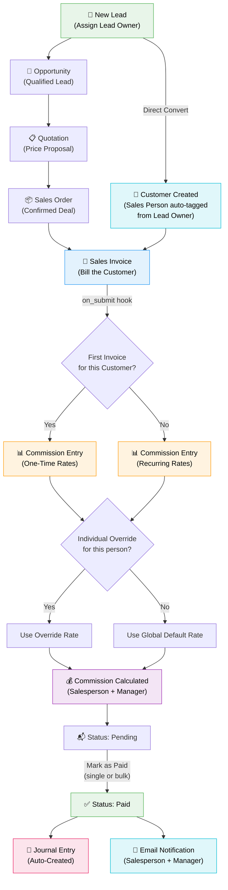

# Commission Engine for ERPNext

**Automated multi-level sales commission calculation for ERPNext v16**

Commission Engine automatically calculates salesperson and manager commissions when Sales Invoices are submitted. It supports first-invoice (one-time) and recurring commission rates, individual rate overrides, automated journal entries, email notifications, and role-based access control.

---

## Full Operation Flow



### Flow Summary

| Stage | What Happens |
|-------|-------------|
| **Lead Created** | Assign a Lead Owner (user who manages this lead) |
| **Lead → Customer** | Sales Person auto-tagged from Lead Owner (User → Employee → Sales Person) |
| **Sales Invoice Submitted** | Commission Entry auto-created via `on_submit` hook |
| **First Invoice?** | System checks if this customer had any prior submitted invoices |
| **Rate Selection** | Individual override checked first → falls back to global default |
| **Commission Calculated** | Salesperson % + Manager % applied to the allocated invoice amount |
| **Mark as Paid** | Journal Entry auto-created + Email sent to salesperson & manager |

---

## Installation

```bash
# Get the app
bench get-app https://github.com/codepromaxtech/erpnext_crm_commission_engine.git

# Install on your site
bench --site your-site.com install-app commission_engine

# Build and restart
bench build --app commission_engine
sudo supervisorctl restart all
```

**On install, the app automatically:**
- Creates **Commission Expense** and **Commission Payable** accounts for all companies
- Links the accounts in Commission Settings
- Enables **Auto-Create Journal Entry on Payment** by default

---

## User Guide

### Step 1: Set Up Sales Person Hierarchy

Before anything else, set up your sales team structure:

1. Go to **Selling → Sales Person**
2. Build your tree hierarchy:

```
All Sales Persons
├── Regional Manager A          ← earns manager commission
│   ├── Salesperson 1           ← earns salesperson commission
│   ├── Salesperson 2
│   └── Salesperson 3
├── Regional Manager B
│   ├── Salesperson 4
│   └── Salesperson 5
```

3. For each Sales Person, link an **Employee** (which must have a **User ID** set)
4. This linkage enables:
   - Auto-tagging when converting leads
   - Role-based access control
   - Email notifications

### Step 2: Configure Commission Rates

Go to **Commission Engine → Commission Settings**:

#### Global Default Rates

These apply to everyone unless overridden:

| Setting | Description |
|---------|-------------|
| First Invoice - Salesperson % | Commission on the first invoice to a new customer |
| First Invoice - Manager % | Manager's override commission on first invoices |
| Recurring - Salesperson % | Commission on all subsequent invoices |
| Recurring - Manager % | Manager's override on recurring invoices |

#### Individual Rate Overrides

For specific people who need different rates:

| Field | Description |
|-------|-------------|
| Sales Person | The person getting a custom rate |
| Role | `Salesperson` or `Manager` |
| First Invoice % | Override for first invoices (leave blank = use global) |
| Recurring % | Override for recurring invoices (leave blank = use global) |

**Example:** All managers get 5% globally, but Manager C gets 5.5%:
- Add a row: `Sales Person = Manager C`, `Role = Manager`, `Recurring = 5.5`

#### Accounting Settings

| Setting | Description |
|---------|-------------|
| Commission Expense Account | Debit account (auto-created on install) |
| Commission Payable Account | Credit account (auto-created on install) |
| Auto-Create Journal Entry | ON by default — auto-creates JE when commission is marked Paid |

### Step 3: Register a Lead

1. Go to **CRM → Lead → + Add Lead**
2. Fill in the lead's details (name, email, company, etc.)
3. **Set the Lead Owner** — this is the user who manages this lead and will earn commission

> **Important:** The Lead Owner must be linked to an Employee, and that Employee must be linked to a Sales Person in the tree.

### Step 4: Convert Lead to Customer

1. Open the Lead → Click **Create → Customer**
2. The system auto-detects the Lead Owner and resolves their Sales Person
3. The **Sales Person is automatically added** to the Customer's Sales Team (100% allocation)
4. A green alert confirms: *"Sales Person X auto-assigned from Lead Owner"*

> You can also go through the full CRM pipeline: Lead → Opportunity → Quotation → Sales Order → Sales Invoice. The Sales Person carries through each step.

### Step 5: Create a Sales Invoice

1. Go to **Accounting → Sales Invoice → + Add Sales Invoice**
2. Select the **Customer** (Sales Team auto-populated from customer defaults)
3. Add your line items
4. Check the **Sales Team** section — verify a Sales Person is listed

> ⚠️ **Warning:** If no Sales Person is tagged:
> - An **orange warning banner** appears on the form
> - A **confirmation dialog** shows when you try to submit
> - You can still submit, but no commission will be created

5. **Submit** the Sales Invoice

### Step 6: Commission Entry (Auto-Created)

When the invoice is submitted, the system automatically:

1. Detects if this is the **first invoice** for this customer → **One-Time** rates
2. Or a **subsequent invoice** → **Recurring** rates
3. Resolves the **manager** from the Sales Person tree hierarchy
4. Checks for **individual rate overrides** → falls back to global defaults
5. Creates a **Commission Entry** with calculated amounts

**Where to find it:**
- Sales Invoice form → sidebar → **Commission** section
- Or go to **Commission Engine → Commission Entry** list

### Step 7: Pay the Commission

**Single payment:**
1. Open the Commission Entry → **Actions → Mark as Paid**
2. Journal Entry auto-created + Email notification sent

**Bulk payment:**
1. Go to Commission Entry list
2. Select multiple Pending entries (checkboxes)
3. Click **Menu → Mark as Paid**
4. All selected entries processed at once

### Step 8: View Commission Report

1. Go to **Commission Engine → Commission Summary**
2. Available filters:
   - **Date range** — by commission month
   - **Sales Person** — individual's commissions
   - **Manager** — all commissions under a manager
   - **Status** — Pending / Paid
   - **Type** — One-Time / Recurring
   - **Company** — for multi-company setups
3. The report includes:
   - **Bar chart** — Top salesperson commissions
   - **Summary cards** — Total SP, Manager, Grand Total, and Pending payable

---

## Subscription / Recurring Invoices

For customers with ERPNext Subscriptions (monthly recurring billing):

1. Make sure the **Customer** has a Sales Person set in their **Sales Team** table
2. When a Subscription generates a Sales Invoice and auto-submits it:
   - The `sales_team` is inherited from the Customer
   - Our `on_submit` hook fires → Commission Entry auto-created
   - First subscription invoice = "One-Time" rates
   - All subsequent = "Recurring" rates

> **Tip:** If you set up the Lead → Customer conversion with the Lead Owner assigned, the Sales Person is auto-tagged and all future subscription invoices will generate commissions automatically.

---

## Role-Based Access Control

Commission entries are filtered based on the logged-in user's role:

| Role | What They See |
|------|--------------|
| **Sales User** | Only their own commissions (where they are the salesperson) |
| **Sales Manager** | Their own + their team members' commissions (all descendants in the Sales Person tree) |
| **Accounts User / Accounts Manager** | All commissions across the company |
| **System Manager / Administrator** | All commissions |

### How It Works

```
User logs in
  → System resolves: User → Employee → Sales Person
  → Applies appropriate filter based on role

Sales User (e.g., Salesperson 3):
  Sees: Only commissions where sales_person = "Salesperson 3"

Sales Manager (e.g., Regional Manager A):
  Sees: Commissions where sales_person or manager is themselves
        OR any of their descendants (Salesperson 1, 2, 3)

Admin / Accounts:
  Sees: Everything
```

### Requirements for Access Control

Each user in the system must be properly linked:

```
User (email/login) → Employee (user_id field) → Sales Person (employee field)
```

Without this linkage, the user won't see any commission entries.

---

## Auto-Created Accounting Accounts

When the app is installed (or a new Company is created), the following accounts are auto-created:

| Account | Type | Parent |
|---------|------|--------|
| Commission Expense - [ABBR] | Expense Account | Indirect Expenses |
| Commission Payable - [ABBR] | Payable | Current Liabilities |

These are automatically linked in Commission Settings for the default company.

---

## Email Notifications

When a commission is marked as **Paid**, the system automatically emails:
- The **Salesperson** — with their commission amount
- The **Manager** — with their manager commission amount

The email contains a formatted table with:
- Commission Entry reference
- Sales Invoice reference
- Customer name
- Salesperson & Manager commission amounts
- Total commission

> The email address is resolved from: Sales Person → Employee → Preferred Email / Company Email / Personal Email

---

## Sales Invoice Integration

On every Sales Invoice form, the Commission Engine adds:

- **Warning banner** (draft) — if no Sales Person is in the Sales Team
- **Submit confirmation** — asks for confirmation if submitting without a sales person
- **Commission table** (submitted) — shows all linked Commission Entries with amounts, type, and status badges
- **Sidebar connections** — Commission Entries appear in the Sales Invoice's sidebar under "Commission"

---

## Features Summary

- ✅ Automatic commission calculation on Sales Invoice submission
- ✅ First-invoice vs Recurring rate detection per customer
- ✅ Manager commissions via Sales Person tree hierarchy
- ✅ Individual rate overrides per person per role
- ✅ Auto Journal Entry creation on payment
- ✅ Email notifications to salesperson and manager on payment
- ✅ Bulk Mark as Paid from list view
- ✅ Commission Summary report with charts and summary cards
- ✅ Sales Invoice integration (warning banners + commission table)
- ✅ Auto Sales Person tagging on Lead → Customer conversion
- ✅ Multi-company support (auto-creates accounts for new companies)
- ✅ Subscription/recurring invoice support
- ✅ Role-based access control (Sales User / Manager / Admin)
- ✅ Rich dashboard UI with stat cards and status indicators

---

## License

MIT
